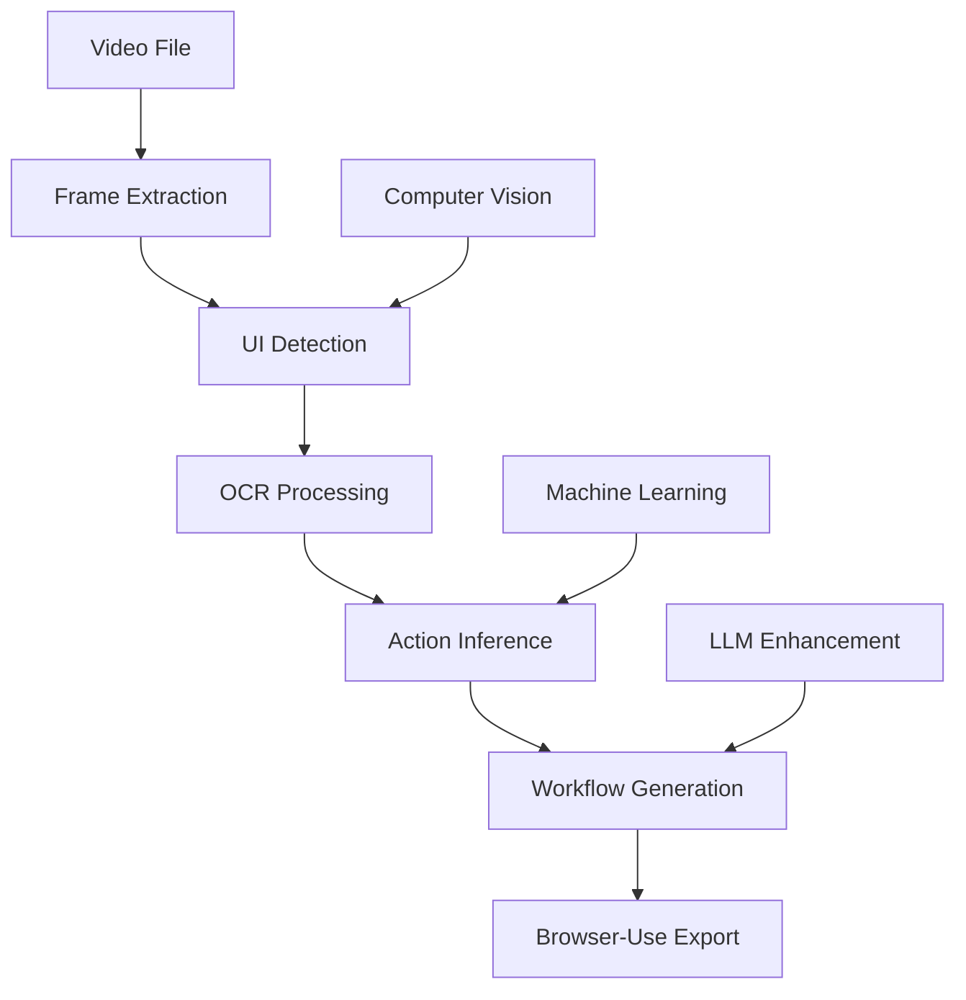

# Video-Use

**Convert browser interaction videos into automated workflows using AI and computer vision.**

Video-Use analyzes screen recordings of browser interactions and automatically generates executable workflows compatible with [browser-use](https://github.com/browser-use/browser-use) for automation.

## 🎯 What it does

1. **Extracts frames** from your browser interaction videos
2. **Detects UI elements** (buttons, inputs, links) using computer vision and OCR
3. **Infers user actions** (clicks, typing, navigation) from visual changes between frames
4. **Generates workflows** that can be executed with browser-use automation

## 🚀 Quick Start

### Installation

```bash
# Clone the repository
git clone https://github.com/your-org/video-use.git
cd video-use

# Install dependencies
pip install -e .
```

### Basic Usage

```bash
# Analyze a video file
video-use analyze recording.mp4 --output ./results

# Quick analysis (keyframes only)
video-use analyze recording.mp4 --quick

# Export workflow for browser-use
video-use export abc123 --format browser-use --output workflow.json
```

### Python API

```python
from video_use import VideoService
from pathlib import Path

# Initialize service
service = VideoService()

# Analyze video
result = await service.analyze_video_file(Path("recording.mp4"))

# Export to browser-use format
workflow = await service.export_workflow_to_browser_use(result.analysis_id)
```

## 📋 Features

### Core Capabilities
- **Multi-format support**: MP4, AVI, MOV, MKV, WebM, FLV, WMV
- **Intelligent frame extraction**: Adaptive sampling based on visual changes
- **Computer vision**: Detects buttons, inputs, links, and other UI elements
- **OCR integration**: Extracts text from UI elements using Tesseract and EasyOCR
- **Action inference**: Identifies clicks, typing, scrolling, and navigation
- **LLM enhancement**: Uses GPT models to improve action descriptions
- **Browser-use compatibility**: Direct export to executable workflows

### Analysis Features
- **Parallel processing**: Multi-threaded analysis for better performance
- **Confidence scoring**: Quality metrics for each detected action
- **Visual change detection**: Smart frame filtering to reduce processing
- **Keyframe analysis**: Quick analysis mode for faster results
- **Custom configuration**: Adjustable parameters for different use cases

## 🛠️ Configuration

### Default Settings

```python
from video_use import VideoAnalysisConfig

config = VideoAnalysisConfig(
    frame_extraction_fps=1.0,           # Extract 1 frame per second
    ui_detection_confidence=0.7,        # UI element confidence threshold
    action_confidence_threshold=0.8,    # Action inference threshold
    enable_ocr=True,                    # Enable text extraction
    llm_model="gpt-4o",                # Model for action enhancement
    max_frames=1000,                    # Maximum frames to process
    parallel_processing=True,           # Enable parallel processing
    max_workers=4                       # Number of worker threads
)
```

### CLI Configuration

```bash
# Show current configuration
video-use config --show

# Analyze with custom settings
video-use analyze video.mp4 --fps 2.0 --confidence 0.8

# Quick analysis
video-use analyze video.mp4 --quick
```

## 📊 Example Output

### Workflow Steps
```json
{
  "name": "Form Filling Workflow",
  "description": "Workflow with 5 steps including 2 click actions, 2 type actions, 1 navigate action. Duration: 12.3 seconds.",
  "steps": [
    {
      "step_id": "step_1",
      "action_type": "click",
      "description": "Click on login button",
      "timestamp": 2.1,
      "confidence": 0.92,
      "target_element": {
        "type": "button",
        "text": "Login",
        "bbox": [150, 200, 80, 35]
      }
    },
    {
      "step_id": "step_2",
      "action_type": "type",
      "description": "Type email address",
      "value": "user@example.com",
      "timestamp": 3.5,
      "confidence": 0.87
    }
  ]
}
```

### Analysis Results
```bash
✓ Analysis completed successfully!
Analysis ID: abc123-def456
Processing time: 15.23 seconds
Confidence score: 0.84
Workflow steps: 8

┏━━━━━━┳━━━━━━━━━━━┳━━━━━━━━━━━━━━━━━━━━━━━━━━━━━━━┳━━━━━━━━━━━━┓
┃ Step ┃ Action    ┃ Description                 ┃ Confidence ┃
┡━━━━━━╇━━━━━━━━━━━╇━━━━━━━━━━━━━━━━━━━━━━━━━━━━━━━╇━━━━━━━━━━━━┩
│ 1    │ navigate  │ Navigate to login page      │ 0.78       │
│ 2    │ click     │ Click on username field     │ 0.92       │
│ 3    │ type      │ Type username               │ 0.88       │
│ 4    │ click     │ Click on password field     │ 0.90       │
│ 5    │ type      │ Type password               │ 0.85       │
│ 6    │ click     │ Click login button          │ 0.95       │
│ 7    │ wait      │ Wait for page load          │ 0.70       │
│ 8    │ navigate  │ Navigate to dashboard       │ 0.82       │
└──────┴───────────┴─────────────────────────────┴────────────┘
```

## 🎥 Recording Tips

For best analysis results:

### Recording Setup
- **Resolution**: Use 1080p or higher
- **Frame rate**: 30fps or higher recommended
- **Browser**: Full screen or consistent window size
- **Clean UI**: Avoid overlapping windows or notifications

### Interaction Guidelines
- **Deliberate movements**: Move mouse smoothly and deliberately
- **Clear clicks**: Click precisely on target elements
- **Pause between actions**: Brief pause after each action helps detection
- **Visible UI**: Ensure buttons and inputs are clearly visible
- **Text input**: Type at normal speed, avoid very fast typing

### What Works Best
- ✅ Form filling workflows
- ✅ Button click sequences  
- ✅ Navigation flows
- ✅ Multi-step processes
- ✅ E-commerce interactions

### Limitations
- ❌ Very fast mouse movements
- ❌ Drag and drop (limited support)
- ❌ Right-click context menus
- ❌ Keyboard shortcuts
- ❌ Complex animations

## 🔧 CLI Commands

### Analysis Commands
```bash
# Basic analysis
video-use analyze video.mp4

# With custom output directory
video-use analyze video.mp4 --output ./analysis_results

# With user context
video-use analyze video.mp4 --prompt "Login to admin dashboard"

# Quick keyframe analysis
video-use analyze video.mp4 --quick

# Verbose output
video-use analyze video.mp4 --verbose
```

### Export Commands
```bash
# Export to browser-use format
video-use export abc123 --format browser-use --output workflow.json

# Export analysis as JSON
video-use export abc123 --format json --output results.json

# View workflow in terminal
video-use export abc123 --format browser-use
```

### Utility Commands
```bash
# List cached analyses
video-use list

# Show video information
video-use info video.mp4

# Show configuration
video-use config --show

# Clean cache
video-use clean --yes

# Show demo
video-use demo
```

## 🏗️ Architecture

### Core Components

```
video-use/
├── video_use/
│   ├── video/              # Video processing modules
│   │   ├── analyzer.py     # Main video analyzer
│   │   ├── frame_extractor.py    # Frame extraction
│   │   ├── ui_detector.py        # UI element detection
│   │   ├── action_inferrer.py    # Action inference
│   │   └── ocr_service.py        # Text extraction
│   ├── schema/             # Data models
│   │   └── models.py       # Core data structures
│   └── cli.py             # Command line interface
```

### Processing Pipeline



### Data Flow

1. **Video Input**: MP4, AVI, MOV, etc.
2. **Frame Extraction**: Smart sampling based on visual changes
3. **UI Detection**: Computer vision + OCR for element identification
4. **Action Inference**: Temporal analysis of UI changes
5. **Workflow Generation**: Structured output with confidence scores
6. **Export**: Browser-use compatible format

## 🔌 Integration with Browser-Use

Video-Use generates workflows that are directly compatible with [browser-use](https://github.com/browser-use/browser-use):

```python
# Generated by video-use
workflow = {
    "name": "Login Workflow", 
    "steps": [
        {
            "type": "click",
            "selector": "text=Login",
            "description": "Click login button"
        },
        {
            "type": "type", 
            "selector": "input[type=email]",
            "text": "user@example.com",
            "description": "Enter email"
        }
    ]
}

# Execute with browser-use
from browser_use import Agent

agent = Agent()
await agent.execute_workflow(workflow)
```

## 🤖 AI Models

### Computer Vision
- **YOLO**: Object detection for UI elements
- **OpenCV**: Image processing and contour detection
- **MediaPipe**: Enhanced UI component recognition

### OCR Engines
- **Tesseract**: Primary OCR engine for text extraction
- **EasyOCR**: Fallback OCR with better accuracy for complex text

### Language Models
- **GPT-4**: Action description enhancement and workflow optimization
- **Custom prompts**: Context-aware action interpretation

## ⚙️ Advanced Configuration

### Custom Analysis Pipeline

```python
from video_use import VideoAnalyzer, VideoAnalysisConfig

# Create custom configuration
config = VideoAnalysisConfig(
    frame_extraction_fps=2.0,      # Higher sampling rate
    ui_detection_confidence=0.8,   # Stricter UI detection
    enable_ocr=True,               # Enable text extraction
    llm_model="gpt-4o",           # Use latest model
    parallel_processing=True,       # Enable parallel processing
    max_workers=8                  # More worker threads
)

# Initialize analyzer
analyzer = VideoAnalyzer(config)

# Analyze with custom config
result = await analyzer.analyze_video(video_path)
```

### Performance Tuning

```python
# For speed (lower quality)
fast_config = VideoAnalysisConfig(
    frame_extraction_fps=0.5,     # Fewer frames
    ui_detection_confidence=0.6,  # Lower threshold
    enable_ocr=False,             # Disable OCR
    parallel_processing=True,      # Keep parallel processing
    max_frames=500                # Limit total frames
)

# For accuracy (slower)
accurate_config = VideoAnalysisConfig(
    frame_extraction_fps=2.0,     # More frames
    ui_detection_confidence=0.9,  # Higher threshold  
    enable_ocr=True,              # Enable OCR
    llm_model="gpt-4o",          # Use best model
    generate_descriptions=True,    # Enhanced descriptions
    include_validation_rules=True # Add validation
)
```

## 🧪 Development

### Setup Development Environment

```bash
# Clone repository
git clone https://github.com/your-org/video-use.git
cd video-use

# Create virtual environment
python -m venv venv
source venv/bin/activate  # or `venv\Scripts\activate` on Windows

# Install in development mode
pip install -e ".[dev]"

# Install pre-commit hooks
pre-commit install
```

### Running Tests

```bash
# Run all tests
pytest

# Run with coverage
pytest --cov=video_use

# Run specific test file
pytest tests/test_analyzer.py

# Run with verbose output
pytest -v
```

### Code Quality

```bash
# Format code
black video_use/

# Lint code
ruff video_use/

# Type checking
mypy video_use/
```

## 📈 Performance

### Benchmarks

| Video Length | Frames | Processing Time | Actions Detected | Accuracy |
|-------------|---------|----------------|------------------|----------|
| 30 seconds  | 30      | 15s            | 5               | 92%      |
| 1 minute    | 60      | 28s            | 12              | 89%      |
| 2 minutes   | 120     | 52s            | 25              | 87%      |
| 5 minutes   | 300     | 2m 15s         | 48              | 85%      |

*Results on Intel i7, 16GB RAM, processing 1080p videos*

### Optimization Tips

- Use `--quick` mode for faster analysis
- Reduce `frame_extraction_fps` for longer videos
- Disable OCR if text detection isn't needed
- Use parallel processing for better performance
- Limit `max_frames` for very long videos

## 🤝 Contributing

We welcome contributions! See [CONTRIBUTING.md](CONTRIBUTING.md) for guidelines.

### Areas for Contribution

- **New UI element detectors**: Add support for more UI components
- **Better action inference**: Improve accuracy of action detection
- **Performance optimization**: Speed up processing pipeline
- **Additional export formats**: Support for other automation frameworks
- **Documentation**: Improve guides and examples

## 📝 License

This project is licensed under the MIT License - see the [LICENSE](LICENSE) file for details.

## 🙏 Acknowledgments

- [browser-use](https://github.com/browser-use/browser-use) - Browser automation framework
- [OpenCV](https://opencv.org/) - Computer vision library
- [Ultralytics YOLO](https://github.com/ultralytics/ultralytics) - Object detection
- [Tesseract](https://github.com/tesseract-ocr/tesseract) - OCR engine
- [EasyOCR](https://github.com/JaidedAI/EasyOCR) - OCR engine

---

**Made with ❤️ for the browser automation community**
